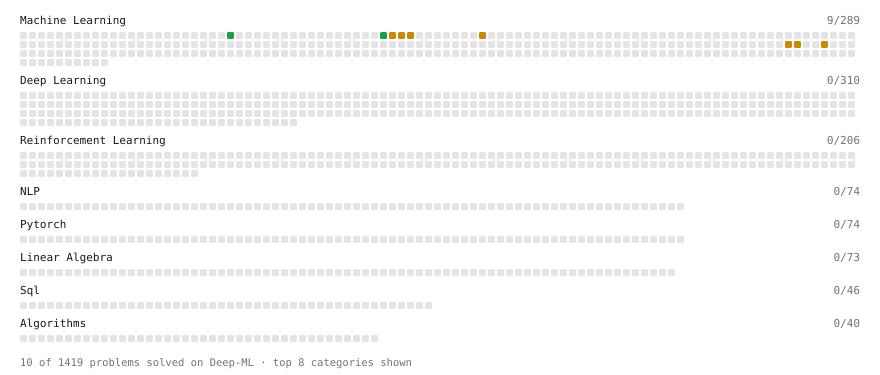

# Deep-ML

My machine learning practice from [Deep-ML](https://www.deep-ml.com). Every solution here was written by hand.

**30** solved · 25 problems · 1 labs · 4 math

[**Browse the interactive portfolio**](https://HughesSeanKyle.github.io/deep-ml/) to replay this filling in over time.

## Problems

| | Difficulty | Solved | |
| --- | --- | --- | --- |
| [Balance Dataset via Undersampling](https://www.deep-ml.com/problems/1057) | easy | 2026-09-22 | [solution](problems/1057-balance-dataset-via-undersampling) |
| [Calculate SVM Margin Width](https://www.deep-ml.com/problems/282) | easy | 2026-09-20 | [solution](problems/0282-calculate-svm-margin-width) |
| [Implement Early Stopping Based on Validation Loss](https://www.deep-ml.com/problems/135) | easy | 2026-09-17 | [solution](problems/0135-implement-early-stopping-based-on-validation-loss) |
| [Implement Gini Impurity Calculation for a Set of Classes](https://www.deep-ml.com/problems/64) | easy | 2026-09-17 | [solution](problems/0064-implement-gini-impurity-calculation-for-a-set-of-classes) |
| [Implement Hinge Loss for SVM](https://www.deep-ml.com/problems/283) | easy | 2026-09-20 | [solution](problems/0283-implement-hinge-loss-for-svm) |
| [Implement Polynomial Kernel Function](https://www.deep-ml.com/problems/281) | easy | 2026-09-21 | [solution](problems/0281-implement-polynomial-kernel-function) |
| [Implement Weight Decay as L2 Regularization](https://www.deep-ml.com/problems/198) | easy | 2026-09-16 | [solution](problems/0198-implement-weight-decay-as-l2-regularization) |
| [Linear Kernel Function](https://www.deep-ml.com/problems/45) | easy | 2026-09-20 | [solution](problems/0045-linear-kernel-function) |
| [Bernoulli Naive Bayes Classifier](https://www.deep-ml.com/problems/140) | medium | 2026-09-17 | [solution](problems/0140-bernoulli-naive-bayes-classifier) |
| [Bias-Variance Decomposition from Bootstrap](https://www.deep-ml.com/problems/804) | medium | 2026-09-17 | [solution](problems/0804-bias-variance-decomposition-from-bootstrap) |
| [Calculate Explained Variance Ratio for PCA](https://www.deep-ml.com/problems/350) | medium | 2026-09-18 | [solution](problems/0350-calculate-explained-variance-ratio-for-pca) |
| [Elastic Net Regression via Gradient Descent](https://www.deep-ml.com/problems/139) | medium | 2026-09-16 | [solution](problems/0139-elastic-net-regression-via-gradient-descent) |
| [Find the Best Gini-Based Split for a Binary Decision Tree](https://www.deep-ml.com/problems/138) | medium | 2026-09-17 | [solution](problems/0138-find-the-best-gini-based-split-for-a-binary-decision-tree) |
| [Gaussian Naive Bayes Classifier](https://www.deep-ml.com/problems/261) | medium | 2026-09-18 | [solution](problems/0261-gaussian-naive-bayes-classifier) |
| [Handle Imbalanced Data with SMOTE](https://www.deep-ml.com/problems/357) | medium | 2026-09-21 | [solution](problems/0357-handle-imbalanced-data-with-smote) |
| [Implement Grid Search](https://www.deep-ml.com/problems/288) | medium | 2026-09-18 | [solution](problems/0288-implement-grid-search) |
| [Implement K-Nearest Neighbors](https://www.deep-ml.com/problems/173) | medium | 2026-09-17 | [solution](problems/0173-implement-k-nearest-neighbors) |
| [Implement Precision-Recall Curve](https://www.deep-ml.com/problems/278) | medium | 2026-09-22 | [solution](problems/0278-implement-precision-recall-curve) |
| [Implement RBF (Gaussian) Kernel Function](https://www.deep-ml.com/problems/280) | medium | 2026-09-20 | [solution](problems/0280-implement-rbf-gaussian-kernel-function) |
| [Implement ROC Curve Calculation](https://www.deep-ml.com/problems/276) | medium | 2026-09-22 | [solution](problems/0276-implement-roc-curve-calculation) |
| [Implement Stratified K-Fold Cross-Validation](https://www.deep-ml.com/problems/840) | medium | 2026-09-18 | [solution](problems/0840-implement-stratified-k-fold-cross-validation) |
| [Learning Curve Generator for Bias-Variance Diagnosis](https://www.deep-ml.com/problems/800) | medium | 2026-09-17 | [solution](problems/0800-learning-curve-generator-for-bias-variance-diagnosis) |
| [Polynomial Regression Fit](https://www.deep-ml.com/problems/801) | medium | 2026-09-16 | [solution](problems/0801-polynomial-regression-fit) |
| [Reconstruction Error from PCA](https://www.deep-ml.com/problems/353) | medium | 2026-09-18 | [solution](problems/0353-reconstruction-error-from-pca) |
| [Train Softmax Regression with Gradient Descent](https://www.deep-ml.com/problems/105) | hard | 2026-09-18 | [solution](problems/0105-train-softmax-regression-with-gradient-descent) |

## Labs

| | Difficulty | Solved | |
| --- | --- | --- | --- |
| [Train a Binary Classifier](https://www.deep-ml.com/labs/23) | easy | 2026-09-15 | [solution](labs/0023-train-a-binary-classifier) |

## Math

| | Difficulty | Solved | |
| --- | --- | --- | --- |
| [Class Imbalance and Proper Scoring](https://www.deep-ml.com/math-problems/44) | easy | 2026-09-21 | [solution](math/0044-class-imbalance-and-proper-scoring) |
| [Model Selection: CV, AIC, and BIC](https://www.deep-ml.com/math-problems/43) | easy | 2026-09-16 | [solution](math/0043-model-selection-cv-aic-and-bic) |
| [Bias–Variance Decomposition](https://www.deep-ml.com/math-problems/39) | medium | 2026-09-16 | [solution](math/0039-bias-variance-decomposition) |
| [Margins and Soft-Margin SVMs](https://www.deep-ml.com/math-problems/42) | medium | 2026-09-19 | [solution](math/0042-margins-and-soft-margin-svms) |

---

_This file is regenerated by Deep-ML on every push._
