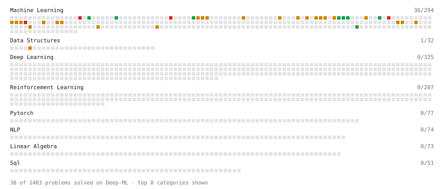

# Deep-ML

My machine learning practice from [Deep-ML](https://www.deep-ml.com). Every solution here was written by hand.

**73** solved · 56 problems · 9 labs · 8 math

[**Browse the interactive portfolio**](https://HughesSeanKyle.github.io/deep-ml/) to replay this filling in over time.

## Problems

| | Difficulty | Solved | |
| --- | --- | --- | --- |
| [Add a Bias Vector to a Batch via Broadcasting](https://www.deep-ml.com/problems/882) | easy | 2026-10-10 | [solution](problems/0882-add-a-bias-vector-to-a-batch-via-broadcasting) |
| [Balance Dataset via Undersampling](https://www.deep-ml.com/problems/1057) | easy | 2026-09-22 | [solution](problems/1057-balance-dataset-via-undersampling) |
| [Calculate SVM Margin Width](https://www.deep-ml.com/problems/282) | easy | 2026-09-20 | [solution](problems/0282-calculate-svm-margin-width) |
| [Compute a Gradient with PyTorch Autograd](https://www.deep-ml.com/problems/884) | easy | 2026-10-10 | [solution](problems/0884-compute-a-gradient-with-pytorch-autograd) |
| [Compute Multi-class Cross-Entropy Loss](https://www.deep-ml.com/problems/134) | easy | 2026-10-08 | [solution](problems/0134-compute-multi-class-cross-entropy-loss) |
| [Create a Float Tensor from a Python List](https://www.deep-ml.com/problems/880) | easy | 2026-10-10 | [solution](problems/0880-create-a-float-tensor-from-a-python-list) |
| [Implement a Linear Layer Forward Pass with Matrix Multiplication](https://www.deep-ml.com/problems/883) | easy | 2026-10-10 | [solution](problems/0883-implement-a-linear-layer-forward-pass-with-matrix-multiplication) |
| [Implement Early Stopping Based on Validation Loss](https://www.deep-ml.com/problems/135) | easy | 2026-09-17 | [solution](problems/0135-implement-early-stopping-based-on-validation-loss) |
| [Implement Gini Impurity Calculation for a Set of Classes](https://www.deep-ml.com/problems/64) | easy | 2026-09-17 | [solution](problems/0064-implement-gini-impurity-calculation-for-a-set-of-classes) |
| [Implement Hard Voting Classifier](https://www.deep-ml.com/problems/305) | easy | 2026-09-28 | [solution](problems/0305-implement-hard-voting-classifier) |
| [Implement Hinge Loss for SVM](https://www.deep-ml.com/problems/283) | easy | 2026-09-20 | [solution](problems/0283-implement-hinge-loss-for-svm) |
| [Implement Polynomial Kernel Function](https://www.deep-ml.com/problems/281) | easy | 2026-09-21 | [solution](problems/0281-implement-polynomial-kernel-function) |
| [Implement Weight Decay as L2 Regularization](https://www.deep-ml.com/problems/198) | easy | 2026-09-16 | [solution](problems/0198-implement-weight-decay-as-l2-regularization) |
| [Linear Kernel Function](https://www.deep-ml.com/problems/45) | easy | 2026-09-20 | [solution](problems/0045-linear-kernel-function) |
| [Reshape and Transpose a Tensor](https://www.deep-ml.com/problems/881) | easy | 2026-10-10 | [solution](problems/0881-reshape-and-transpose-a-tensor) |
| [Bernoulli Naive Bayes Classifier](https://www.deep-ml.com/problems/140) | medium | 2026-09-17 | [solution](problems/0140-bernoulli-naive-bayes-classifier) |
| [Bias-Variance Decomposition from Bootstrap](https://www.deep-ml.com/problems/804) | medium | 2026-09-17 | [solution](problems/0804-bias-variance-decomposition-from-bootstrap) |
| [Calculate AUC (Area Under ROC Curve)](https://www.deep-ml.com/problems/277) | medium | 2026-09-22 | [solution](problems/0277-calculate-auc-area-under-roc-curve) |
| [Calculate BIC/AIC for Model Selection](https://www.deep-ml.com/problems/368) | medium | 2026-10-01 | [solution](problems/0368-calculate-bic-aic-for-model-selection) |
| [Calculate Expected Calibration Error (ECE)](https://www.deep-ml.com/problems/260) | medium | 2026-10-01 | [solution](problems/0260-calculate-expected-calibration-error-ece) |
| [Calculate Explained Variance Ratio for PCA](https://www.deep-ml.com/problems/350) | medium | 2026-09-18 | [solution](problems/0350-calculate-explained-variance-ratio-for-pca) |
| [Calculate Performance Metrics for a Classification Model](https://www.deep-ml.com/problems/77) | medium | 2026-10-01 | [solution](problems/0077-calculate-performance-metrics-for-a-classification-model) |
| [Elastic Net Regression via Gradient Descent](https://www.deep-ml.com/problems/139) | medium | 2026-09-16 | [solution](problems/0139-elastic-net-regression-via-gradient-descent) |
| [Elbow Method for K-Means](https://www.deep-ml.com/problems/827) | medium | 2026-09-30 | [solution](problems/0827-elbow-method-for-k-means) |
| [Find the Best Gini-Based Split for a Binary Decision Tree](https://www.deep-ml.com/problems/138) | medium | 2026-09-17 | [solution](problems/0138-find-the-best-gini-based-split-for-a-binary-decision-tree) |
| [Gaussian Mixture Model with EM Algorithm](https://www.deep-ml.com/problems/341) | medium | 2026-10-01 | [solution](problems/0341-gaussian-mixture-model-with-em-algorithm) |
| [Gaussian Naive Bayes Classifier](https://www.deep-ml.com/problems/261) | medium | 2026-09-18 | [solution](problems/0261-gaussian-naive-bayes-classifier) |
| [Handle Imbalanced Data with SMOTE](https://www.deep-ml.com/problems/357) | medium | 2026-09-21 | [solution](problems/0357-handle-imbalanced-data-with-smote) |
| [Implement DBSCAN Clustering Algorithm](https://www.deep-ml.com/problems/259) | medium | 2026-09-30 | [solution](problems/0259-implement-dbscan-clustering-algorithm) |
| [Implement Gaussian Mixture Model (GMM) E-step](https://www.deep-ml.com/problems/365) | medium | 2026-09-30 | [solution](problems/0365-implement-gaussian-mixture-model-gmm-e-step) |
| [Implement Gaussian Mixture Model (GMM) M-step](https://www.deep-ml.com/problems/366) | medium | 2026-10-01 | [solution](problems/0366-implement-gaussian-mixture-model-gmm-m-step) |
| [Implement Gradient Boosting Regressor Step](https://www.deep-ml.com/problems/344) | medium | 2026-09-29 | [solution](problems/0344-implement-gradient-boosting-regressor-step) |
| [Implement Grid Search](https://www.deep-ml.com/problems/288) | medium | 2026-09-18 | [solution](problems/0288-implement-grid-search) |
| [Implement K-Means++ Initialization](https://www.deep-ml.com/problems/362) | medium | 2026-09-30 | [solution](problems/0362-implement-k-means-initialization) |
| [Implement K-Nearest Neighbors](https://www.deep-ml.com/problems/173) | medium | 2026-09-17 | [solution](problems/0173-implement-k-nearest-neighbors) |
| [Implement Out-of-Bag Score Calculation](https://www.deep-ml.com/problems/345) | medium | 2026-09-29 | [solution](problems/0345-implement-out-of-bag-score-calculation) |
| [Implement Precision-Recall Curve](https://www.deep-ml.com/problems/278) | medium | 2026-09-22 | [solution](problems/0278-implement-precision-recall-curve) |
| [Implement Random Forest Feature Importance](https://www.deep-ml.com/problems/343) | medium | 2026-09-29 | [solution](problems/0343-implement-random-forest-feature-importance) |
| [Implement RBF (Gaussian) Kernel Function](https://www.deep-ml.com/problems/280) | medium | 2026-09-20 | [solution](problems/0280-implement-rbf-gaussian-kernel-function) |
| [Implement ROC Curve Calculation](https://www.deep-ml.com/problems/276) | medium | 2026-09-22 | [solution](problems/0276-implement-roc-curve-calculation) |
| [Implement Stratified K-Fold Cross-Validation](https://www.deep-ml.com/problems/840) | medium | 2026-09-18 | [solution](problems/0840-implement-stratified-k-fold-cross-validation) |
| [Implement the Huber Loss Function](https://www.deep-ml.com/problems/192) | medium | 2026-10-02 | [solution](problems/0192-implement-the-huber-loss-function) |
| [Learning Curve Generator for Bias-Variance Diagnosis](https://www.deep-ml.com/problems/800) | medium | 2026-09-17 | [solution](problems/0800-learning-curve-generator-for-bias-variance-diagnosis) |
| [Linear Discriminant Analysis (LDA) Binary Classifier](https://www.deep-ml.com/problems/798) | medium | 2026-10-02 | [solution](problems/0798-linear-discriminant-analysis-lda-binary-classifier) |
| [Multinomial Naive Bayes Classifier](https://www.deep-ml.com/problems/817) | medium | 2026-10-02 | [solution](problems/0817-multinomial-naive-bayes-classifier) |
| [Permutation Feature Importance](https://www.deep-ml.com/problems/812) | medium | 2026-09-22 | [solution](problems/0812-permutation-feature-importance) |
| [Polynomial Regression Fit](https://www.deep-ml.com/problems/801) | medium | 2026-09-16 | [solution](problems/0801-polynomial-regression-fit) |
| [Quadratic Discriminant Analysis (QDA) Classifier](https://www.deep-ml.com/problems/799) | medium | 2026-10-03 | [solution](problems/0799-quadratic-discriminant-analysis-qda-classifier) |
| [Reconstruction Error from PCA](https://www.deep-ml.com/problems/353) | medium | 2026-09-18 | [solution](problems/0353-reconstruction-error-from-pca) |
| [Silhouette Score for Clustering Evaluation](https://www.deep-ml.com/problems/254) | medium | 2026-09-30 | [solution](problems/0254-silhouette-score-for-clustering-evaluation) |
| [Implement AdaBoost Fit Method](https://www.deep-ml.com/problems/38) | hard | 2026-09-29 | [solution](problems/0038-implement-adaboost-fit-method) |
| [Implement Bagging Classifier from Scratch](https://www.deep-ml.com/problems/307) | hard | 2026-09-29 | [solution](problems/0307-implement-bagging-classifier-from-scratch) |
| [Implement Kernel PCA with RBF Kernel](https://www.deep-ml.com/problems/349) | hard | 2026-10-02 | [solution](problems/0349-implement-kernel-pca-with-rbf-kernel) |
| [Implement Stacking Classifier](https://www.deep-ml.com/problems/346) | hard | 2026-09-30 | [solution](problems/0346-implement-stacking-classifier) |
| [Pegasos Kernel SVM Implementation](https://www.deep-ml.com/problems/21) | hard | 2026-10-02 | [solution](problems/0021-pegasos-kernel-svm-implementation) |
| [Train Softmax Regression with Gradient Descent](https://www.deep-ml.com/problems/105) | hard | 2026-09-18 | [solution](problems/0105-train-softmax-regression-with-gradient-descent) |

## Labs

| | Difficulty | Solved | |
| --- | --- | --- | --- |
| [Design Your Own Activation Function](https://www.deep-ml.com/labs/9) | easy | 2026-10-10 | [solution](labs/0009-design-your-own-activation-function) |
| [Fix Overfitting with Regularization (Sklearn)](https://www.deep-ml.com/labs/22) | easy | 2026-09-23 | [solution](labs/0022-fix-overfitting-with-regularization-sklearn) |
| [Train a Binary Classifier](https://www.deep-ml.com/labs/23) | easy | 2026-09-15 | [solution](labs/0023-train-a-binary-classifier) |
| [Combine Trained Models into an Ensemble](https://www.deep-ml.com/labs/27) | medium | 2026-10-04 | [solution](labs/0027-combine-trained-models-into-an-ensemble) |
| [Design Your Own Tabular Classifier](https://www.deep-ml.com/labs/35) | medium | 2026-09-25 | [solution](labs/0035-design-your-own-tabular-classifier) |
| [Few-Shot Classification with Cluster-Based Label Propagation](https://www.deep-ml.com/labs/28) | medium | 2026-10-05 | [solution](labs/0028-few-shot-classification-with-cluster-based-label-propagation) |
| [Fix Overfitting with Regularization (NumPy)](https://www.deep-ml.com/labs/21) | medium | 2026-09-22 | [solution](labs/0021-fix-overfitting-with-regularization-numpy) |
| [Build a Digit Classifier from Scratch](https://www.deep-ml.com/labs/20) | hard | 2026-10-05 | [solution](labs/0020-build-a-digit-classifier-from-scratch) |
| [Build a Tree for a Random Forest](https://www.deep-ml.com/labs/26) | hard | 2026-09-24 | [solution](labs/0026-build-a-tree-for-a-random-forest) |

## Math

| | Difficulty | Solved | |
| --- | --- | --- | --- |
| [Class Imbalance and Proper Scoring](https://www.deep-ml.com/math-problems/44) | easy | 2026-09-21 | [solution](math/0044-class-imbalance-and-proper-scoring) |
| [Model Selection: CV, AIC, and BIC](https://www.deep-ml.com/math-problems/43) | easy | 2026-09-16 | [solution](math/0043-model-selection-cv-aic-and-bic) |
| [Bias–Variance Decomposition](https://www.deep-ml.com/math-problems/39) | medium | 2026-09-16 | [solution](math/0039-bias-variance-decomposition) |
| [Margins and Soft-Margin SVMs](https://www.deep-ml.com/math-problems/42) | medium | 2026-09-19 | [solution](math/0042-margins-and-soft-margin-svms) |
| [Statistical Inference](https://www.deep-ml.com/math-problems/27) | medium | 2026-09-28 | [solution](math/0027-statistical-inference) |
| [The EM Algorithm](https://www.deep-ml.com/math-problems/41) | medium | 2026-09-28 | [solution](math/0041-the-em-algorithm) |
| [Bayesian Methods](https://www.deep-ml.com/math-problems/28) | hard | 2026-09-28 | [solution](math/0028-bayesian-methods) |
| [Probabilistic Models](https://www.deep-ml.com/math-problems/29) | hard | 2026-09-28 | [solution](math/0029-probabilistic-models) |

---

_This file is regenerated by Deep-ML on every push._
